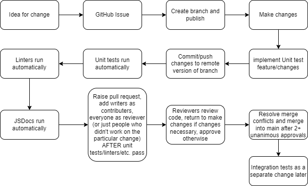

# Phase 1 CI/CD Pipeline

  

Our pipeline is currently completely functional with the features we have implemented. 
The current development process is as follows:

1. Create GitHub issue on fixes/changes
2. Pull latest changes and checkout issue -> create branch for issue
3. Do changes and whatever, create unit tests locally and run unit tests with npm test or vscode jest extension, whatever floats your boat.
4. Write unit tests for changes if applicable. 
5. Document your changes (Including unit tests), ex. new method headers, inline comments explaining your code if you decide to use weird syntax and your code ends up looking like it's running on black magic and people unfamiliar with that syntax have no idea what is going on.
6. Create pull request to merge into branch
   1. GitHub actions will rerun your unit tests and generate documentation, please pull the generated documentation after GitHub actions is done running.
   2. Documentation will be the .html files in the ./docs folder in of the project root directory
   3. Ensure your files pass the linter.
7. Assign people not involved in your changes to review pull request
8. Resolve merge conflicts -> merge once 2+ unanimous approvals
9.  Prune branches
10. Integration tests later as a separate change.

For unit tests, we are currently using Jest, a popular unit-testing framework for JavaScript, it took a bit of finessing and shenanigans with bootstrap but we got it to successfully test entire features scuh as adding profiles and ensuring it gets added to the page correctly.  

For linting, we are using htmlhint, stylelint (css), and eslint (js) to ensure our files follow our style guidelines, which consist of ensuring that the linters pass, snake case for everything, and enough comments so that reviewers understand what's going on.

For documentation, we have JSDocs automatically run on pull requests to main and output the pages into the `./docs` folder. 

The only major feature that is unimplemented is code quality, which we briefly explored and scrapped after seeing that the majority services that provide it seemed to cost money and we are all poor college students that don't want to pay for that kind of stuff.  

After taking another look at it, we saw that there is actually a way to use CodeClimate for free for public repositories. Since Warrantracker is in a public repository, we thought it could be worth another shot to try to get code-quality checking working again, so it is currently planned to be automated in our pipeline by Phase 2. 
