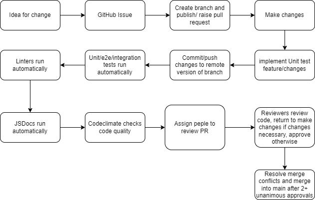

# Phase 2 CI/CD Pipeline

After phase 1, we've implemented 2 major-ish changes to our CI/CD Pipeline

Changes

1. Code climate will now check commits on pull requests to see if code quality is not garbage.
2. Due to the difficulty of running E2E tests without a local development server, the pipeline will now ignore end to end tests and expect reviewers to run end to end tests themselves before merging. It is the **REVIEWER'S** responsibility to ensure that tests pass before merging, though reviewers may scream at people that push failing code if they wish :). (This change is currently only active on e2e branch, tests will say they failed on any other branch at the moment)

  

The current development process is as follows:

1. Create GitHub issue on fixes/changes
2. Pull latest changes and checkout issue -> create branch for issue
3. Do changes and whatever, create unit tests locally and run unit tests with npm test or vscode jest extension, whatever floats your boat.
4. Write unit tests for changes if applicable. 
5. Document your changes (Including unit tests), ex. new method headers, inline comments explaining your code if you decide to use weird syntax and your code ends up looking like it's running on black magic and people unfamiliar with that syntax have no idea what is going on.
6. Create pull request to merge into branch
   1. GitHub actions will rerun your unit tests and generate documentation, please pull the generated documentation after GitHub actions is done running.
      1. Will ignore end to end tests
   2. Documentation will be the .html files in the ./docs folder in of the project root directory
   3. Ensure your files pass the linter.
   4. Codeclimate will ensure code meets minimum standards
      1. Will automatically leave comments where things can be improved.
7. Assign people not involved in your changes to review pull request
8. Resolve merge conflicts -> merge once 2+ unanimous approvals
9. Prune branches

For unit tests, we are currently using Jest, a popular unit-testing framework for JavaScript, it took a bit of finessing and shenanigans with bootstrap but we got it to successfully test entire features scuh as adding profiles and ensuring it gets added to the page correctly.  

For linting, we are using htmlhint, stylelint (css), and eslint (js) to ensure our files follow our style guidelines, which consist of ensuring that the linters pass, snake case for everything, and enough comments so that reviewers understand what's going on.

For documentation, we have JSDocs automatically run on pull requests to main and output the pages into the `./docs` folder.

We are currently using codeclimate for code quality, just to ensure we have automatic insults ready in case someone pushes an 1800 line file for isEven().
