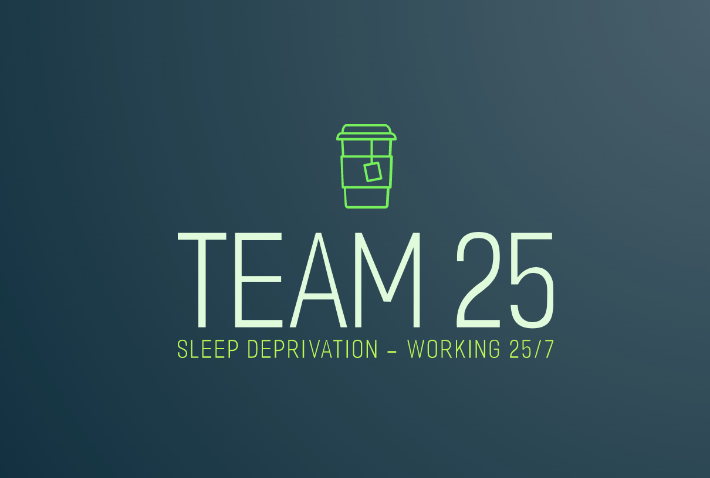
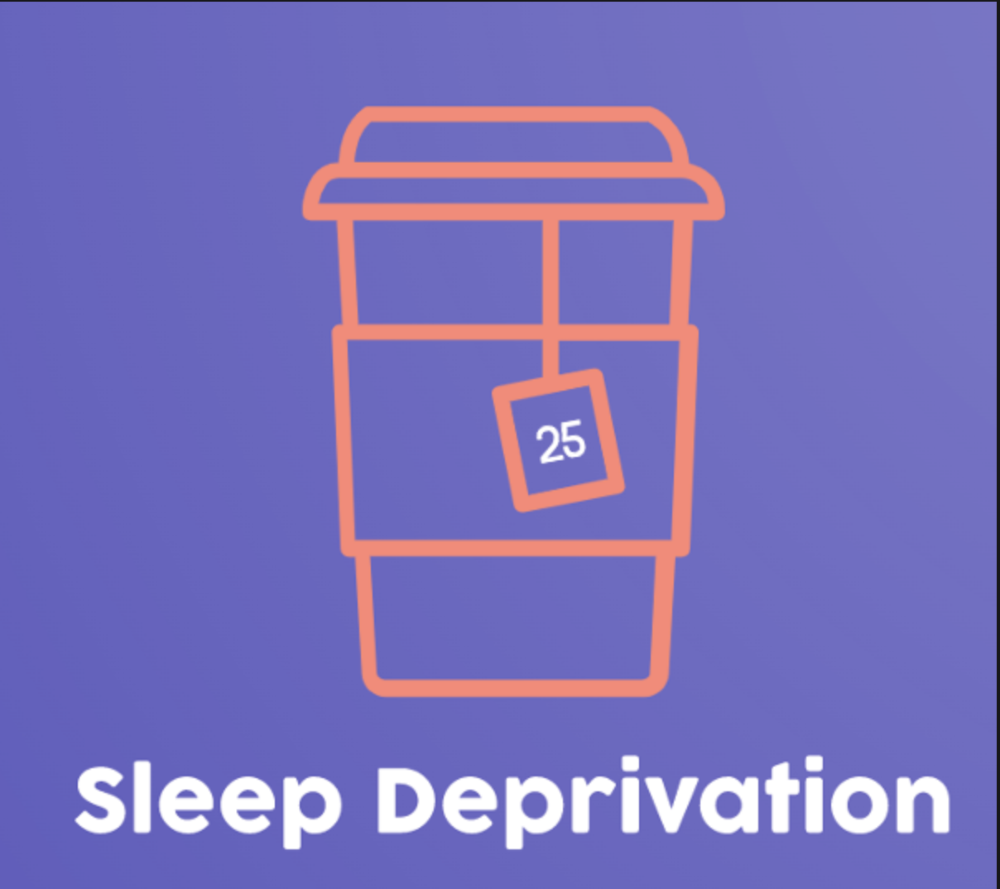

###### PAGE OF TEAM 25

## Team Name: Sleep Deprivation

## Team Color: Blue, Green, Purple, Orange
## Team Font: Comfortaa - Semi bold

> "Sleeping is the truest form of freedom" - Someone, probably

## Team Roster:

### Yiren Zhou
I am a third year Math: CS major student in Sixth College, serving as a team lead. [My github page](https://xiaoxi-yiren.github.io/page_project/)

### Yong Liang
I am a second-year MS student. I am interested in software engineering and networked systems. [Gihub Page](https://chrisliang12.github.io/cse110-lab0/)

### Sia Sheth:
I am a third year Math: CS major in Muir College. [My GitHub page](https://siasheth.github.io/cse110-lab1/)

### Benjamin Xia
I’m a second year Computer Science major in Muir College. [My GitHub Page](https://benjxia.github.io/CSE110-Lab-1/)

### Siya Rajpal:
I am a third year Political Science: Data Analytics major with a technical breadth in Computer Science in Revelle College. [My GitHub Page](https://sirajpal.github.io/GitHubPagesProject/)

### Janav Kati
I am a third year Computer Engineering Major in Revelle College. [My GitHub Page](https://kjgr.github.io/pages-repo/) 

### Karthik Vetrivelan
I am a third year Computer Engineering student in Sixth College. [My GitHub Page](https://karthikv6.github.io/GithubPages/)

### Anish Kulkarni
I’m a third year Computer Engineering Major in Sixth College. [My GitHub Page](https://anishkulkarni9001.github.io/CSE110Lab0/)

### Xinyi Li
I'm a 4th year Computer Science student in Marshall College. [My GitHub Page](https://github.com/xil111/CSE110.git)

### Rena Wu
I am a fourth year student majoring in Computer Science in Sixth College. [My Github Page](https://renawuq.github.io/cse110first/)

## Team Roles (Tentative)

### Frontend

- Siya Rajpal
- Rena Wu
- Anish Kulkarni

### Backend
- Sia Sheth
- Ben Xia
- Yong Liang
- Janav Kati

### UI Designers
- Rena Wu

### UX Designers
- Xinyi Li
- Ben Xia*

### Testing/QA
- Janav Kati
- Ben Xia
- Yiren Zhou
- Yong Liang

### Team Leads
- Yiren Zhou
- Karthik Vetrivelan